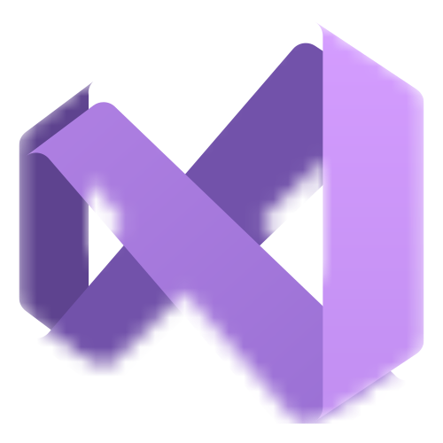
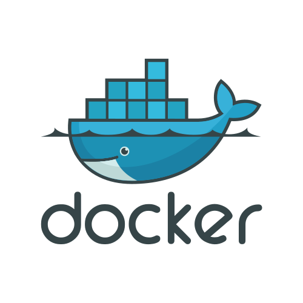

## 👋 Hi , I'm Anurag
 💻 I'm a recent **AI & ML(B.E) Graduate** 
 💼 Actively seeking a job. 
 📠Graduated in July 2024. 
 📃 My [Portfolio](https://anuragmunde.framer.website/)         [⬇ Download Resume](https://framerusercontent.com/assets/hZGsHO5nMwMkWd5U8d2Uro8sck.pdf)
 
### 💫 About Me:
#### 👯  **I’m looking to collaborate on  :**  ML projects; Software Development; Web Projects;  
#### 🌱  **I’m currently learning  :**          Rust Embedded Programming🦀, 
					  GPU compiler 🟩 ; 

<!-- # 🌱 I’m currently learning:   Multiplayer game Server; Torrent-client in go;  -->
<!-- # 💫 About Me: -->
<!-- 🔭 I’m currently working on  :    Networking in c++ , go ;  Backend in Spring(java). 👯 I’m looking to collaborate on:   Web Projects;  🌱 I’m currently learning:   Multiplayer game Server; Torrent-client in go; 💬 Status Right now:   recent Computer Science graduate actively seeking a job.                         -->

### 💻 Tech Stack:

	
	
	
	
	<!---->
	
	 
	
	
	
	
	
	
	
	<!--   -->
	
	
	<!--  -->
	
	
	
	
	<!-- 
	
	 
	 
	 -->
	<!--   -->
	<!-- 
	 -->
	<!--  -->
	<!--  -->
	<!--  -->
	<!-- 	 -->
	<!--  -->
	<!--  -->
	<!--  -->
	<!--  -->
	<!--  -->

<!--### 📊 GitHub Stats: 
<!--       -->   
<!-- -->

  
**🌠Socials:**       
 
## 📈 Leetcode Stats:

<!--

---
-->

<!-- Proudly created with GPRM ( https://gprm.itsvg.in ) -->
<!--   

