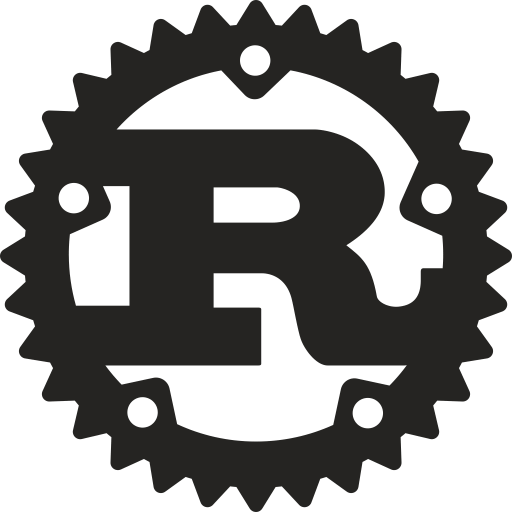

## 👋 Hi , I'm Anurag
 - 💻 **AI & ML (B.E) Graduate** 
 - 💼 SWE @ [Cloudanix](https://www.cloudanix.com/) <!-- - 📠Graduated in July 2024.  -->
 - 🕸 My [Portfolio](https://anuragmunde.framer.website/)         
 - 📃My Resume : [⬇ Download Resume](https://drive.usercontent.google.com/download?id=1RCh4CBZrzl6f6f264CReMTtfAbO2FRTn&export=download&authuser=0&confirm=t&uuid=dc3b8f19-3dc7-4ec0-a5ff-3bfe4ed49292&at=AN_67v3ItlTsWTbb1BWDgMUn06Xd:1728591632887)  
 - 📕 Currently reading :  The Book of kubernetes ([preview](https://nostarch.com/download/BookofKubernetes_TOC.pdf))
 
## 💫 About Me:
- 👯  **I’m looking to collaborate on  :** `ML projects; Software Development; Web Projects;`  
- 🌱  **I’m currently learning  :**         ☸️ `Kubernetes.`

<!-- # 🌱 I’m currently learning:   Multiplayer game Server; Torrent-client in go;  -->
<!-- # 💫 About Me: -->
<!-- 🔭 I’m currently working on  :    Networking in c++ , go ;  Backend in Spring(java). 👯 I’m looking to collaborate on:   Web Projects;  🌱 I’m currently learning:   Multiplayer game Server; Torrent-client in go; 💬 Status Right now:   recent Computer Science graduate actively seeking a job. -->

## 💻 Tech Stack:

<!-- aws,nextjs,rust,ts-->
<!-- 

  

-->
<!-- 

	
	
	
	
	 
	
	
	
	
	
	
	
	
	
	
	
	
	
	
	 -->

<!--### 📊 GitHub Stats: 
<!--   -->   
<!-- -->

## 🌐 Socials:
      
 
## 📈 Leetcode Stats:

<!--

---
-->

<!-- Proudly created with GPRM ( https://gprm.itsvg.in ) -->
<!--   

